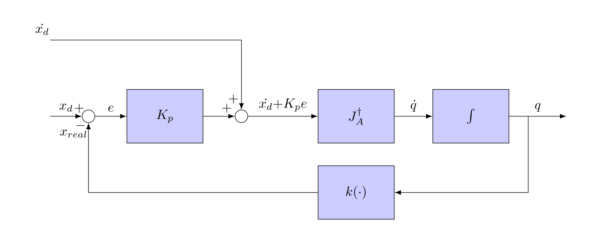

Kinematics and dynamics solvers and controllers.

Link to Doxygen generated documentation: http://robots.uc3m.es/dox-kinematics-dynamics

    

## Installation

Installation instructions for installing from source can be found [here](doc/kinematics-dynamics-install.md).

## Contributing

#### Posting Issues

1. Read [CONTRIBUTING.md](https://github.com/roboticslab-uc3m/kinematics-dynamics/blob/master/CONTRIBUTING.md)
2. [Post an issue / Feature request / Specific documentation request](https://github.com/roboticslab-uc3m/kinematics-dynamics/issues)

#### Fork & Pull Request

1. [Fork the repository](https://github.com/roboticslab-uc3m/kinematics-dynamics/fork)
2. Create your feature branch (`git checkout -b my-new-feature`) off the `develop` branch, following the [GitFlow git workflow](https://www.atlassian.com/git/tutorials/comparing-workflows/gitflow-workflow)
3. Commit your changes
4. Push to the branch (`git push origin my-new-feature`)
5. Create a new Pull Request

## Status

[)](https://travis-ci.org/roboticslab-uc3m/kinematics-dynamics)

## Links of interest:

* [yarp-devices](https://github.com/roboticslab-uc3m/yarp-devices)
* [vision](https://github.com/roboticslab-uc3m/vision)
