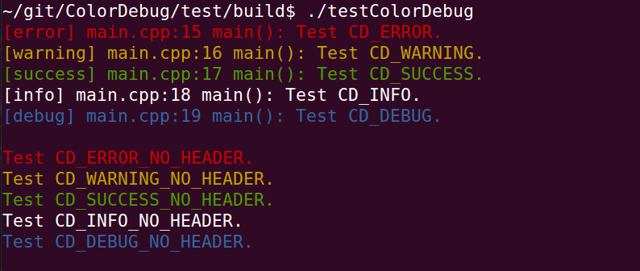

ColorDebug
==========

Color CLI logs and more. For updated version, license and author information, see ColorDebug.hpp.

[](./)

Possible usages:

* Install system-wide. `mkdir -p build && cd build && cmake .. && make && sudo make install`

* Use externally. `mkdir -p build && cd build && cmake .. && make`. Set the `ColorDebug_DIR` environment variable to your `build` path. In CMake, you will be able to `find_package(ColorDebug)` and then `include_directories(${COLOR_DEBUG_INCLUDE_DIRS})`.

* Part of a project. You will be able to `include_directories(${COLOR_DEBUG_INCLUDE_DIRS})`. Note: In CMake, *before* you `add_subdirectory(ColorDebug)`, you must `set(COLOR_DEBUG_PART_OF_PROJECT TRUE)` to avoid a re-declaration of the `install` target.

An interesting setup is including the following lines in your father `CMakeLists.txt`:

```
# ColorDebug options
option(ColorDebug_FULL_FILE "Choose if you want to compile with CD_FULL_FILE" FALSE)
if(ColorDebug_FULL_FILE)
    add_definitions(-DCD_FULL_FILE)
endif(ColorDebug_FULL_FILE)

option(ColorDebug_HIDE_ERROR "Choose if you want to compile with CD_HIDE_ERROR" FALSE)
if(ColorDebug_HIDE_ERROR)
    add_definitions(-DCD_HIDE_ERROR)
endif(ColorDebug_HIDE_ERROR)

option(ColorDebug_HIDE_WARNING "Choose if you want to compile with CD_HIDE_WARNING" FALSE)
if(ColorDebug_HIDE_WARNING)
    add_definitions(-DCD_HIDE_WARNING)
endif(ColorDebug_HIDE_WARNING)

option(ColorDebug_HIDE_SUCCESS "Choose if you want to compile with CD_HIDE_SUCCESS" FALSE)
if(ColorDebug_HIDE_SUCCESS)
    add_definitions(-DCD_HIDE_SUCCESS)
endif(ColorDebug_HIDE_SUCCESS)

option(ColorDebug_HIDE_INFO "Choose if you want to compile with CD_HIDE_INFO" FALSE)
if(ColorDebug_HIDE_INFO)
    add_definitions(-DCD_HIDE_INFO)
endif(ColorDebug_HIDE_INFO)

option(ColorDebug_HIDE_DEBUG "Choose if you want to compile with CD_HIDE_DEBUG" FALSE)
if(ColorDebug_HIDE_DEBUG)
    add_definitions(-DCD_HIDE_DEBUG)
endif(ColorDebug_HIDE_DEBUG)
```

