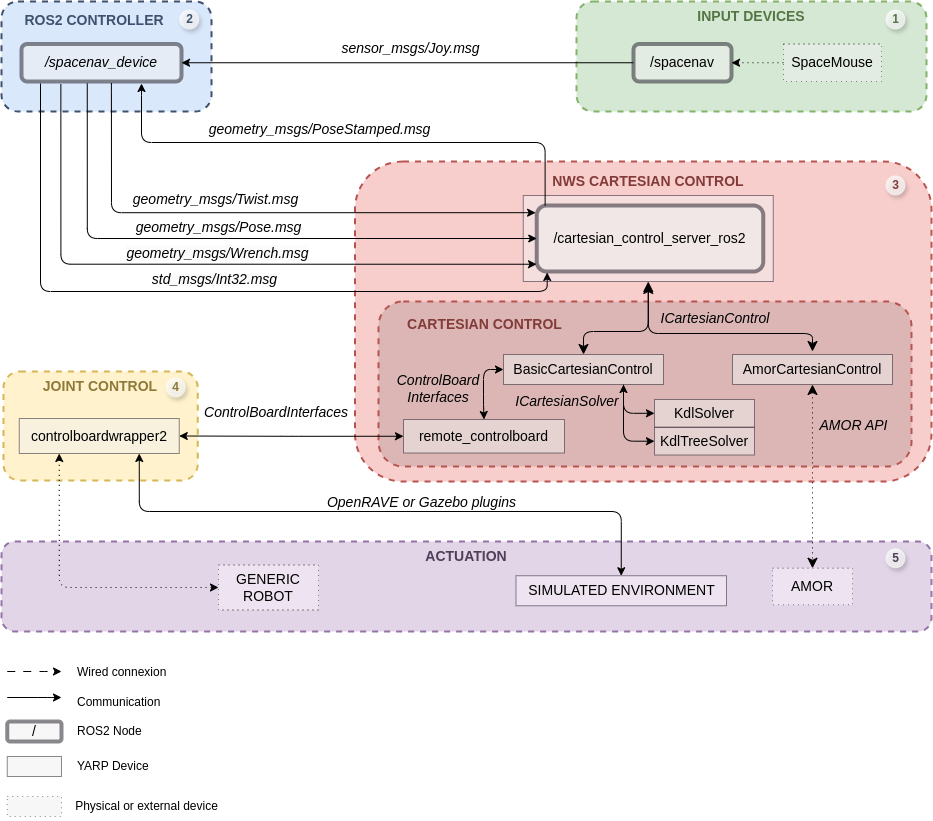

# cartesian-controllers

**Cartesian Controller** Server that combines ROS2 and YARP for generic system teleoperation.

This project integrates YARP and ROS 2 to provide a Cartesian control server for robots. It enables communication with a YARP subdevice through its ICartesianControl interface, while allowing the robot's current position to be published and commands to be received via ROS 2 nodes.

Original work: María de las Mercedes Rebollo Rayo, *Implementación en ROS 2 de un controlador
genérico para teleoperación de un robot
manipulador mediante un ratón 3D*, Trabajo Fin de Grado, Universidad Carlos III de Madrid, 2024. https://github.com/mercerebo1/cartesian-controllers


## Overview
The CartesianControlServerROS2 package is part of the cartesian-controllers repository. It acts as a bridge between YARP and ROS 2, providing real-time control and feedback for robotic systems. The server allows for the manipulation of the robot’s position, velocity, and force/torque, as well as gripper control.


## Key Features
* Direct control via YARP's ICartesianControl interface.
* ROS 2 integration for publishing robot states and receiving commands from ROS 2 nodes.
* Supports position, velocity, force/torque, and gripper control via dedicated callbacks.
* Fully configurable parameters such as command types and reference frames (base or TCP).


## Installation
Clone the repository and install the necessary dependencies:

```bash
~$ git clone https://github.com/mercerebo1/cartesian-controllers.git
~$ cd cartesian-controllers
```

Ensure both YARP and ROS 2 are correctly installed and configured on your system.


## Usage example
This Cartesian Control Server was initially created to use BasicCartesianControl as a YARP subdevice from [kinematics-dynamics](https://github.com/roboticslab-uc3m/kinematics-dynamics/tree/master/libraries/YarpPlugins/BasicCartesianControl). Please, see below proposed control arquitecture:



* **Block 1:** /spacenav node from [spacenav](https://index.ros.org/p/spacenav/#humble-overview) package which sends buttons state and linear and angular component of a SpaceMouse.

* **Block 2:** /spacenav_device node from [spacenav_device](https://github.com/mercerebo1/spacenav_device) package that manage analogic data received and proccess data according three control modes: Twist (command velocities to TCP), Pose (command positions to TCP) and Wrench (command forces to TCP).

* **Block 3:** Current Cartesian Control Server ROS 2 which is able to communicate to other ROS 2 nodes and wrap a YARP subdevice (BasicCartesianControl).

* **Block 4:** Joint control from cartesian control applying Inverse Kinematics solver 'Screw Theory' from [kinematics-dynamics](https://github.com/roboticslab-uc3m/kinematics-dynamics/tree/master/libraries/ScrewTheoryLib).

* Block 5: Actuation control accessed by Motor Control Interfaces differentiating between simulated and real environment.

This control arquitecture is a modification from the arquitecture presented in “A generic controller for teleoperation on robotic manipulators using low-cost devices,” [1]. The aim is to start a transition from YARP to ROS 2.


### References

[1] B. Łukawski, J. G. Victores, and C. Balaguer, “A generic controller for teleoperation on robotic manipulators using low-cost devices,” in *XLIV Jornadas de Automática*, 2023, pp. 785-788. [Online]. Available: [https://doi.org/10.17979/spudc.9788497498609.785](https://doi.org/10.17979/spudc.9788497498609.785).


## Available Callbacks:
The server handles multiple types of commands through ROS 2 topics:

* `poseTopic_callback`: Processes Pose messages to send position commands to the controller.
* `twistTopic_callback`: Processes Twist messages to control the robot's velocity.
* `wrenchTopic_callback`: Processes Wrench messages to send force/torque commands.
* `gripperTopic_callback`: Controls the robot’s gripper actuator (open, close, stop).

## Parameter Configuration:
The server allows the configuration of several parameters, including:

* **Transmission command type:** Define the type of control commands (`position`, `velocity`, `force`).
* **Reference frame:** Select between `base` or `TCP` frame for executing commands.

## Code Structure

### CartesianControlServerROS2.cpp
This file implements the main server logic for handling Cartesian control:

* **Subscription Callbacks:** Manages incoming messages to control the robot’s position, velocity, force, and gripper.
* **Parameter Management:** Dynamically adjusts the server's settings based on incoming messages to ensure correct robot control.


### DeviceDriverImpl.cpp
This file handles device-level control, including:

* Initialization and Configuration: Opens the Cartesian control device, sets execution parameters, and initializes the ROS 2 node.
* Publications and Subscriptions: Sends PoseStamped messages and listens for Pose, Twist, Wrench, and Int32 messages for gripper control.
* Robot Control: Defines callbacks for processing commands and sending them to the controller.


### PeriodicThreadImpl.cpp
This file implements the run function, which updates the robot's state periodically:

* State Retrieval: Captures the current position and status of the robot.
* Time Conversion: Converts timestamps for ROS 2 message compatibility.
* Orientation Calculation: Computes robot orientation using the KDL library.
* Message Publication: Sends PoseStamped messages with updated robot state to the ROS 2 topic.


## Contributing
Feel free to submit issues or pull requests to improve the project. Contributions are welcome!
